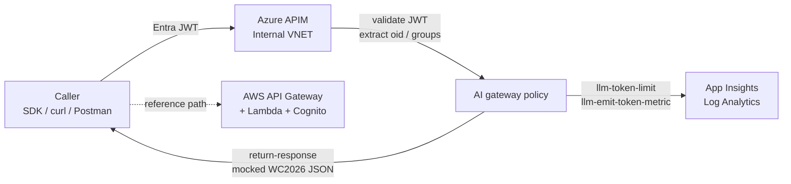

# Multi-Cloud APIM Gateway

A production-style demo of **Azure API Management** acting as an AI gateway in front of a (mocked) AWS-hosted backend, with:

* Microsoft Entra ID JWT validation (federated from AWS SSO / IAM Identity Center)
* Per-user and per-group LLM **token quotas** (`llm-token-limit`)
* Custom **App Insights metrics** with rich identity dimensions (`llm-emit-token-metric`)
* APIM **Internal VNET** deployment via Bicep
* AWS API Gateway HTTP API + Cognito JWT authorizer + Lambda Swagger UI via Terraform
* Mocked **FIFA World Cup 2026** payload as the example response, with a clear migration path to AWS Bedrock + Anthropic / OpenAI

> Built to demonstrate the **governance + identity + telemetry** story for AI workloads spanning Azure and AWS, without spending Bedrock / OpenAI tokens during a demo.

---

## Table of contents

1. [Why this exists](#why-this-exists)
2. [Solution at a glance](#solution-at-a-glance)
3. [Folder structure](#folder-structure)
4. [API](#api)
5. [Quickstart](#quickstart)
6. [Governance model](#governance-model)
7. [Observability](#observability)
8. [Documentation index](#documentation-index)
9. [Troubleshooting & limitations](#troubleshooting--limitations)
10. [AWS cost / Free Tier](#aws-cost--free-tier)
11. [Project status](#project-status)

---

## Why this exists

Enterprises running AI workloads across multiple clouds need **one** place where they can:

* Centrally validate identity (everyone uses the same JWT, no matter which cloud serves the model).
* Apply consistent rate / token / quota policy per user, per team, per business unit.
* Stream uniform telemetry into a single observability stack.
* Switch which backend cloud serves a request without consumers noticing.

This repo is a working blueprint of that pattern with Azure APIM as the policy plane and AWS as the (mocked) model plane.

## Solution at a glance



See [docs/architecture.md](docs/architecture.md) for the full diagram pack and request walk-through.

## Folder structure

```
MultiCloud-APIM-Gateway/
├─ .github/
│  └─ workflows/
│     ├─ deploy-azure.yml          # Bicep what-if + deploy via OIDC
│     └─ deploy-aws.yml            # Terraform fmt/plan/apply via OIDC
├─ aws/
│  ├─ lambda/worldcup/             # Node 20 Lambda: WC2026 payload + Swagger UI
│  ├─ openapi/                     # OpenAPI 3 spec served by the Lambda
│  └─ terraform/                   # Cognito + API Gateway v2 + Lambda + IAM
├─ docs/
│  ├─ architecture.md
│  ├─ implementation-guide.md
│  ├─ deployment-walkthrough.md
│  ├─ testing-walkthrough.md
│  ├─ kql-queries.md
│  ├─ migration-to-bedrock.md
│  ├─ troubleshooting.md
│  └─ known-limitations.md
├─ examples/
│  ├─ curl/                        # valid-token / invalid-token / throttle-burst
│  └─ postman/                     # MultiCloud-APIM-Gateway.postman_collection.json
├─ infra/
│  └─ bicep/
│     ├─ main.bicep                # orchestrator (supports useExistingApim)
│     ├─ main.dev.bicepparam       # pre-filled for apim-poc-my-dev
│     └─ modules/                  # apim, apim-api, namedvalues, vnet,
│                                  # appinsights, loganalytics
├─ policies/
│  ├─ apim-policy.xml              # composed inline policy applied by Bicep
│  └─ fragments/                   # one .xml per logical section,
│                                  # ready to lift into APIM Policy Fragments
├─ scripts/
│  ├─ deploy-azure.ps1
│  ├─ get-token.ps1 / .sh
│  └─ test-api.ps1  / .sh
├─ .gitignore
└─ README.md  ← you are here
```

## API

| Cloud | Base URL | Operation | Auth |
| --- | --- | --- | --- |
| **Azure (APIM)** | `https://apim-poc-my-dev.azure-api.net/worldcup` | `GET /teams` | Microsoft Entra ID Bearer JWT (`aud=api://apim-gateway`) |
| **AWS (API Gateway)** | `https://<id>.execute-api.<region>.amazonaws.com` (from `terraform output api_invoke_url`) | `GET /teams`, `GET /openapi.json`, `GET /swagger`, `GET /health` | Cognito JWT (M2M client_credentials or interactive code flow) |

### Azure (APIM) endpoint

```http
GET https://apim-poc-my-dev.azure-api.net/worldcup/teams
Authorization: Bearer <Entra JWT>
```

* Reachable only from inside the APIM VNet by default (Internal VNET mode).
* Subscription key is **not** required (`subscriptionRequired = false`).
* Returns hardcoded World Cup 2026 JSON via APIM `return-response`.

### AWS endpoint + Swagger UI

```http
GET https://<id>.execute-api.<region>.amazonaws.com/teams
Authorization: Bearer <Cognito JWT>
```

* Swagger UI: `GET /swagger` (paste JWT into `localStorage.authToken`)
* OpenAPI spec: `GET /openapi.json`
* Health probe: `GET /health` (anonymous)

After `terraform apply`, the real URLs are surfaced via `terraform output`:

```bash
terraform -chdir=aws/terraform output api_teams_url
terraform -chdir=aws/terraform output api_swagger_url
```

### Example response (both clouds)

```json
{
  "tournament": "FIFA World Cup 2026",
  "host_countries": ["USA", "Canada", "Mexico"],
  "total_teams": 48,
  "total_matches": 104,
  "kickoff": "2026-06-11",
  "final": "2026-07-19",
  "groups": [
    { "group": "A", "teams": ["Mexico", "..."] },
    { "group": "B", "teams": ["Canada", "..."] }
  ],
  "_source": "mocked",
  "_correlationId": "<guid>"
}
```

## Quickstart

```powershell
# 1. Clone
git clone https://github.com/csdmichael/MultiCloud-APIM-Gateway.git
cd MultiCloud-APIM-Gateway

# 2. Deploy Azure side (uses existing APIM apim-poc-my-dev)
.\scripts\deploy-azure.ps1 `
    -SubscriptionId 86b37969-9445-49cf-b03f-d8866235171c `
    -ResourceGroup ai-myaacoub -WhatIf
.\scripts\deploy-azure.ps1 `
    -SubscriptionId 86b37969-9445-49cf-b03f-d8866235171c `
    -ResourceGroup ai-myaacoub

# 3. Deploy AWS side
cd aws/terraform
cp dev.tfvars.example dev.auto.tfvars
terraform init
terraform apply

# 4. Smoke test
cd ../..
.\scripts\test-api.ps1 -ApimHost apim-poc-my-dev.azure-api.net `
    -TenantId $env:TENANT_ID -ClientId $env:CLIENT_ID -ClientSecret $env:CLIENT_SECRET `
    -Audience api://apim-gateway
```

Full walkthrough → [docs/deployment-walkthrough.md](docs/deployment-walkthrough.md).

## Governance model

The APIM policy enforces, in this order:

1. **`validate-azure-ad-token`** — Reject anything that isn't a valid Entra JWT for the configured audience + tenant + (optionally) client id.
2. **Claims extraction** — `oid`, `tid`, `sub`, `upn`, `preferred_username`, and a multi-valued `groups` claim collapsed into a CSV.
3. **Per-user token bucket** — `llm-token-limit` keyed on `oid`, configurable via Named Value `tokensPerMinuteUser` (default 1000/min) and `tokenQuotaUserPerHour` (default 20 000/h).
4. **Per-group token bucket** — Fires only when the user belongs to `governedGroupObjectId`; configurable via `tokensPerMinuteGroup` and `tokenQuotaGroupPerHour`.
5. **`llm-emit-token-metric`** — Custom App Insights metric in namespace `MultiCloudApimGateway` with dimensions `UserId`, `UserName`, `TenantId`, `Group`, `Environment`, `ApiName`, `Outcome`.
6. **Mock response** — `return-response` short-circuits with the WC2026 payload (no backend call).
7. **`on-error`** — Normalises 401 / 403 / 429 / 5xx into a JSON envelope with `correlationId`.

All knobs are APIM Named Values, tunable without redeploying the Bicep:

```bash
az apim nv update --service-name apim-poc-my-dev --resource-group ai-myaacoub \
    --named-value-id tokensPerMinuteUser --value 2000
```

## Observability

Telemetry lands in the App Insights workspace deployed by `infra/bicep/modules/appinsights.bicep` (or the one wired to your reused APIM). Ready-to-paste KQL queries live in [docs/kql-queries.md](docs/kql-queries.md):

* Top users / groups by tokens consumed
* Throttled vs quota-exceeded responses over time
* p50/p95 latency
* Single-correlation-id end-to-end trace

## Documentation index

| File | Purpose |
| --- | --- |
| [docs/architecture.md](docs/architecture.md) | Component + sequence diagrams, identity model, policy chain |
| [docs/implementation-guide.md](docs/implementation-guide.md) | Step-by-step: Entra app registration, Bicep, Terraform |
| [docs/deployment-walkthrough.md](docs/deployment-walkthrough.md) | Concrete deployment transcript with timings |
| [docs/testing-walkthrough.md](docs/testing-walkthrough.md) | Test matrix, scripts, Postman collection usage |
| [docs/kql-queries.md](docs/kql-queries.md) | Ready-to-paste KQL for App Insights |
| [docs/migration-to-bedrock.md](docs/migration-to-bedrock.md) | Diff to switch from mock to live AWS Bedrock |
| [docs/troubleshooting.md](docs/troubleshooting.md) | Common 401 / 403 / 429 + Bicep / Terraform issues |
| [docs/known-limitations.md](docs/known-limitations.md) | Demo-vs-prod caveats + prioritised next steps |

## Troubleshooting & limitations

The two most-hit issues:

* **APIM is Internal VNET** — gateway is unreachable from the public internet. Call from inside the VNet, a jumpbox, or an App Gateway.
* **JWT audience mismatch** — token's `aud` must match the APIM Named Value `apimAudience` (default `api://apim-gateway`).

See [docs/troubleshooting.md](docs/troubleshooting.md) and [docs/known-limitations.md](docs/known-limitations.md) for the full set.

## AWS cost / Free Tier

The AWS side defaults to a configuration that fits inside **AWS Free Tier**. What's perpetual-free vs time-limited:

| Resource | Free-tier status |
| --- | --- |
| IAM role / policy / OIDC provider | Always free |
| Lambda (`mcgw-dev-worldcup`) | Perpetual free — 1M req + 400K GB-s/month. Defaults to 128 MB / 3 s timeout. |
| Cognito User Pool + interactive (code-flow) app client | Perpetual free — 50,000 MAU/month |
| CloudWatch Log Groups (Lambda + API Gateway access logs) | Perpetual free — 5 GB ingest + 5 GB storage/month. Default retention is 7 days. |
| API Gateway HTTP API | **12-month free tier only** — 1M req/month for the first 12 months of the AWS account, then $1.00 per million requests. No perpetual-free substitute exists for the JWT-protected demo. |
| Cognito M2M app client (`client_credentials` grant) | **NOT in free tier** — $6 per 1,000 monthly token requests. `create_machine_to_machine_client` defaults to `false` so M2M is opt-in. Flip to `true` only when demoing the M2M flow. |

Mocked Azure costs (APIM Internal VNET, Log Analytics, App Insights) are out of free tier from day 1 — see `infra/bicep/main.bicep` for SKUs.

## Project status

This is a **demo / reference implementation**. The mocked path is fully functional; the live AWS Bedrock path is documented as a one-policy-block change in [docs/migration-to-bedrock.md](docs/migration-to-bedrock.md). PRs welcome.
