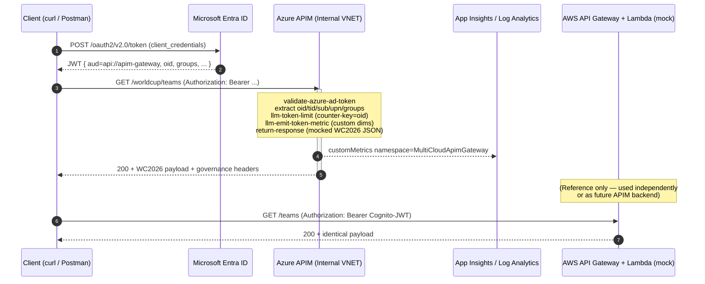
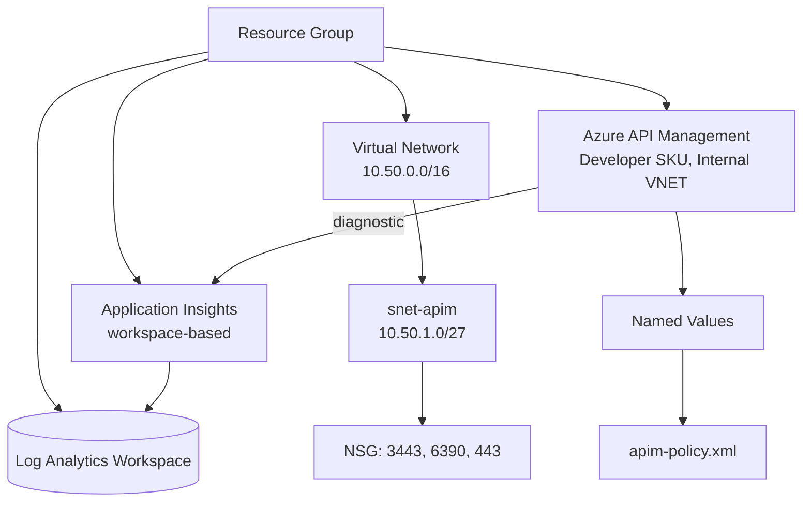
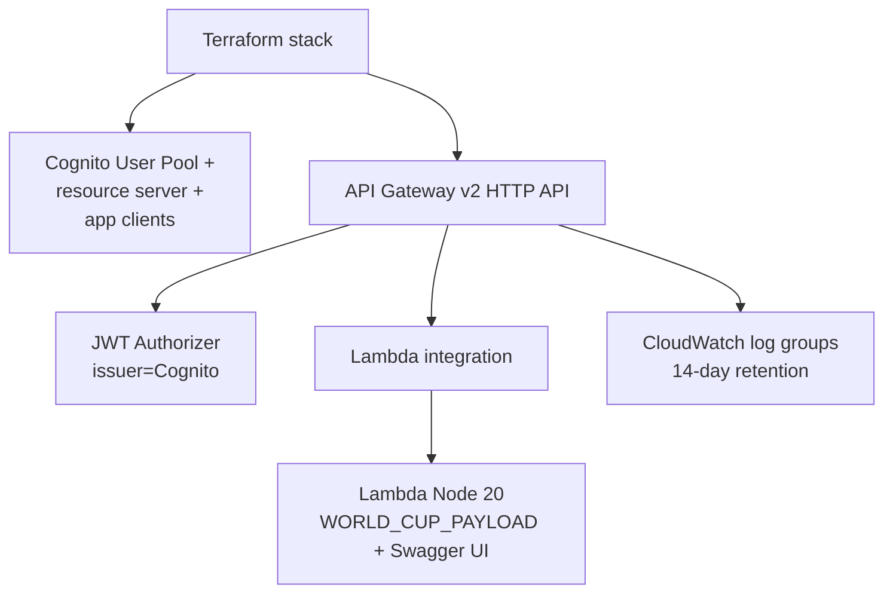

# Architecture

## 1. Goal

Demonstrate a **production-style multi-cloud AI gateway** where:

1. **AWS** owns the upstream "AI" workload (mocked World Cup 2026 API in lieu of Bedrock + Anthropic / OpenAI on AWS).
2. **Azure API Management (APIM)** sits in front as a *governed AI gateway* — validating Microsoft Entra ID JWTs (federated from AWS SSO / IAM Identity Center), enforcing per-user / per-group LLM token quotas, emitting telemetry, and (for this demo) short-circuiting the request with a deterministic mock response.

The full backend call to AWS Bedrock is intentionally **not** invoked — the focus is the governance + identity story. Switching the demo to the live AWS backend is a one-line policy change documented in [migration-to-bedrock.md](migration-to-bedrock.md).

## 2. Identity model

```mermaid
flowchart LR
  user[User in AWS SSO / IAM Identity Center] -->|SAML / OIDC| entra[Microsoft Entra ID]
  entra -->|access token (aud=api://apim-gateway)| client[Client app / CI]
  client -->|Bearer JWT| apim[Azure APIM Internal VNET]
  apim -->|validates JWT + extracts oid/groups| policy[AI gateway policy]
  policy -->|return-response (mocked)| client
  policy -. future .-> aws[AWS API Gateway + Bedrock]
```

* AWS SSO is the workforce identity provider (humans).
* Microsoft Entra ID is federated to AWS SSO so the same user object can also mint an Entra-issued JWT for Azure-side workloads.
* APIM validates that JWT with `validate-azure-ad-token` and extracts authoritative claims (`oid`, `tid`, `sub`, `groups`, `upn`, `preferred_username`).

The AWS-side demo (Lambda + API Gateway + Cognito JWT authorizer) stands in for the AWS Bedrock front door. Cognito plays the role of the IdP because spinning up tenant-level SSO federation purely for the demo is out of scope; the *pattern* is identical.

## 3. End-to-end request flow



Key headers returned by the APIM gateway:

| Header | Meaning |
| --- | --- |
| `x-mcgw-user-oid` | Authenticated user object id (echoed for diagnostics) |
| `x-mcgw-tenant` | Tenant id from the JWT |
| `x-mcgw-user-tokens-consumed` | Tokens consumed by this request (per `llm-token-limit`) |
| `x-mcgw-user-tokens-remaining` | Tokens remaining in the current minute bucket |
| `Retry-After` | Set by APIM on 429 responses |
| `x-correlation-id` | Echo of the caller's id, or `context.RequestId` if absent |

## 4. Policy chain (APIM)

Loaded inline by Bicep via `loadTextContent('../../policies/apim-policy.xml')`. The same logical sections are also published as standalone `<fragment>` files in [`/policies/fragments/`](../policies/fragments/) so they can be lifted into APIM Policy Fragment resources later.

| Section | Policy | Purpose |
| --- | --- | --- |
| 1 | `validate-azure-ad-token` | Reject non-Entra tokens, wrong audience, wrong issuer |
| 2 | `set-variable` x5 + groups CSV | Extract `oid`, `tid`, `sub`, `upn`, `preferred_username`, multi-valued `groups` claim |
| 3 | `set-header` | Surface `x-mcgw-user-oid`, `x-mcgw-tenant` for downstream + log correlation |
| 4 | `llm-token-limit` (counter-key=`oid`) | Per-user TPM bucket. Emits remaining/consumed headers + `Retry-After` on overage |
| 5 | `choose` + `llm-token-limit` (counter-key=`primaryGroup`) | Per-group TPM bucket, fires only when user belongs to the configured `governedGroupObjectId` |
| 6 | `llm-emit-token-metric` | Custom metrics → App Insights `customMetrics` table with dims `UserId`, `UserName`, `TenantId`, `Group`, `Environment`, `ApiName`, `Outcome` |
| 7 | `return-response` | Short-circuits with the mocked World Cup payload built from `JObject` / `JArray` |
| 8 | `on-error` | Normalises 401 / 403 / 429 / 5xx into a JSON envelope with `correlationId` |

## 5. Azure infrastructure (Bicep)



* APIM is Internal VNET-injected — the gateway is reachable only from within the VNet / a paired VNet / a VPN.
* Developer SKU is used for demo cost; **Premium** is required for HA + multi-region + Internal VNET in production.
* App Insights is workspace-based and shares the workspace with any other observability.
* All token-governance knobs (`tokensPerMinuteUser`, `tokenQuotaUserPerHour`, etc.) are surfaced as APIM Named Values so they can be tuned without redeploying Bicep.

## 6. AWS infrastructure (Terraform)



* Single Node 20 Lambda serves `/teams`, `/openapi.json`, `/swagger`, `/health`.
* `/health` is anonymous; everything else requires a Cognito-issued JWT.
* Swagger UI is served by the Lambda itself (no S3/CloudFront), uses SwaggerUIBundle from `unpkg.com`, and stores the user's token in `localStorage.authToken`.

## 7. Mock-vs-real boundary

| Today (demo) | Tomorrow (production) |
| --- | --- |
| `return-response` in `apim-policy.xml` returns hardcoded JSON | Replace with `<forward-request>` to the AWS endpoint |
| Lambda returns hardcoded `WORLD_CUP_PAYLOAD` | Lambda becomes a Bedrock client (or replaced by direct APIM-to-Bedrock backend) |
| `llm-token-limit` uses `estimate-prompt-tokens="true"` | Switch to response-token parsing once a real LLM responds |

See [migration-to-bedrock.md](migration-to-bedrock.md) for the exact diff.
